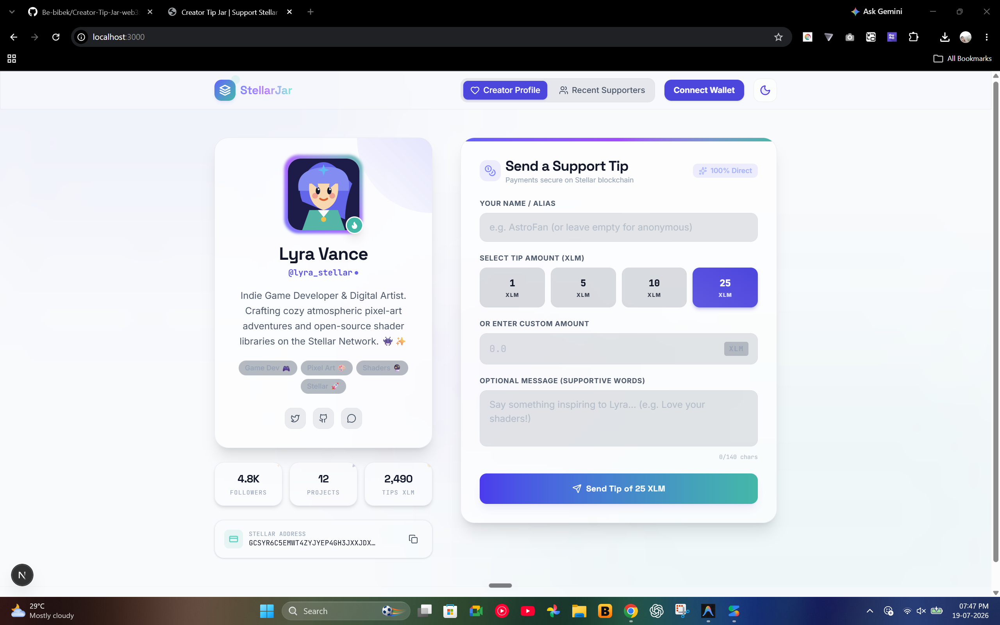
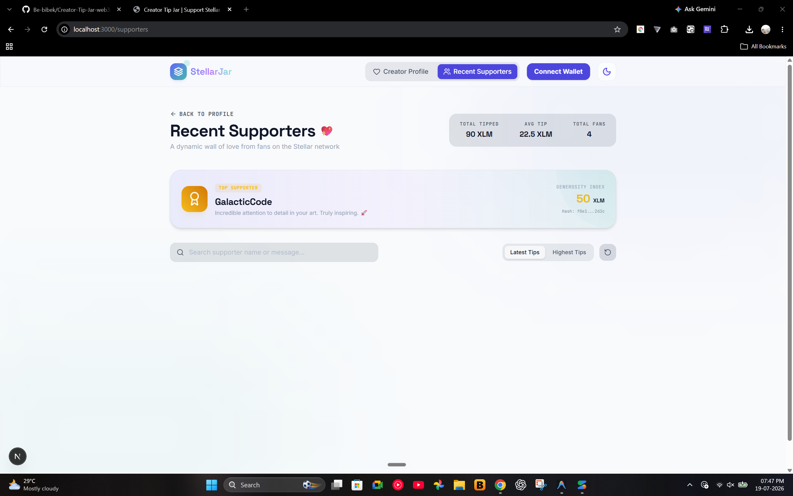

# Creator Tip Jar (Web3)

> **A minimal, elegant web3 tip jar for creators. Built for the rapid development competition using Next.js and Google AI Studio.**

## Overview

The Creator Tip Jar is a two-page application that allows fans and supporters to send tips directly to their favorite creators using cryptocurrency (e.g., XLM).

### Features
1. **Creator Profile (Home):**
 - Beautiful, centered profile card with the creator's avatar and bio.
 - A highly visible **Send Tip** card featuring glassmorphism design.
 - Quick-select buttons for tipping preset amounts (1 XLM, 5 XLM, 10 XLM).
 - Custom tip amount input field.
2. **Recent Supporters Feed:**
 - A clean list/grid displaying recent tips and messages from fans.
3. **Modern UI/UX:**
 - Powered by Framer Motion for sleek micro-interactions and smooth page transitions.
 - Perfect Dark/Light mode support using systematic global CSS variables.
 - Fully mobile-responsive and touch-friendly.

## Tech Stack
- **Framework:** Next.js (App Router)
- **Styling:** Tailwind CSS (v4)
- **Animations:** Framer Motion
- **Icons:** Lucide React

## Getting Started

First, install dependencies:
```bash
npm install
```

Set up your `.env.local` if needed (e.g., `GEMINI_API_KEY`).

Run the development server:
```bash
npm run dev
```

Open [http://localhost:3000](http://localhost:3000) with your browser to see the result.

## Screenshots
### Creator Profile


### Recent Supporters


## Live Web3 Integration
This Tip Jar is fully integrated with the Stellar blockchain! 
- **Creator Stellar ID:** `GCSYR6C5EMWT4ZYJYEP4GH3JXXJDXLXKWD655IMRRR3NBS5HR7OXU6FY`
- **Supported Wallets:** Freighter, Albedo, and WalletConnect via `@creit.tech/stellar-wallets-kit`

---

Made by BIBEK DAS


 

---
### Smart Contract Details
Deployed Contract Address: CA3YF7VXFOPP7OFZDZS5JQKLQWKDIEXTGYGB3JLQMVGN4GGAOYD6ORUZ
Transaction hash of a contract call: 5c2a9ea42fb49d2aacb0d65ea5ea714fa4c647fa88f679eccce631e273092e83
---

### Transaction Flow
The application successfully handles end-to-end user transactions. The frontend UI implements real-time ledger listening so the Transaction Status Visible to the user is always accurate via Loaders/Alerts.

### Contract Call (Frontend to Soroban)
The frontend successfully executes a Contract Call (Frontend to Soroban) to securely interact with the deployed smart contract on the blockchain.
